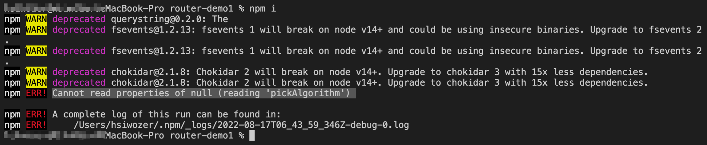

# npm 装包失败分析与解决

1. 在导入Vue项目使用 ' npm i ' 安装node_moduels的时候，终端出现错误如下：

   

   ⚠️  **问题定位：****Cannot read properties of null (reading 'pickAlgorithm')**

   🧰 **解决方法：**在终端输入： `npm cache clear --force`，然后重新运行 `npm i` 命令